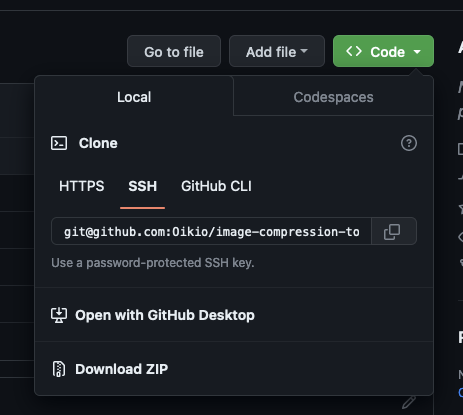

# Image compression tool

Uses PNGquant algorithm to compress PNGs without noticeable visual quality loss. Also can resize images to specified width and height or convert SVGs into PNGs of a particular size.

# Setup

Install LTS version of NodeJS from https://nodejs.org/en.

Download this repository as a ZIP by pressing on `<> Code` button and uncompress it on your Desktop:

Open terminal.

Go to the project folder with this command, **it suggests that you uncompressed the repository on your Desktop and folder is called `image-compression-tool-main`**:

    cd ~/Desktop/image-compression-tool-main

Install packages with this command:

    npm install

Start dry run with this command, it will create `in` and `out` folders:

    npm start

# Usage

Open terminal.

Go to the project folder with this command, **it suggests that you uncompressed the repository on your Desktop and folder is called `image-compression-tool-main`**:

    cd ~/Desktop/image-compression-tool-main

Put PNGs and SVGs you would like to compress into the `in` folder.

Run the script with this command:

    npm start

Compressed PNG files will be in the `out` folder, if it's not first tool run, images in `out` folder will be replaced by new processed ones from `in`, but other file in `out` folder will remain untouched.

## Providing arguments

Command signature looks like this, so you can provide 3 optional arguments:

    npm start [QUALITY] [WIDTH] [HEIGHT]

Here are examples for commands:

    npm start
    npm start 80
    npm start 100 1920 1080

`[QUALITY]` is a number between 0 and 100, where 100 is max quality and should be almost one to one with the original image. If size of the image is too big after compression run it again with lower quality. Suggestion is to decrement it by 10 (100, 90, 80). Quality below 60 might become to look ugly.

`[WIDTH]` and `[HEIGHT]` are numbers that will be used to resize the image. Omit it if resizing is not necessary (e.g. just compressing PNGs). If you process SVGs tool will try to create PNG of a size of SVG viewbox or width/height. If it fails - you can provide width and height manually.
